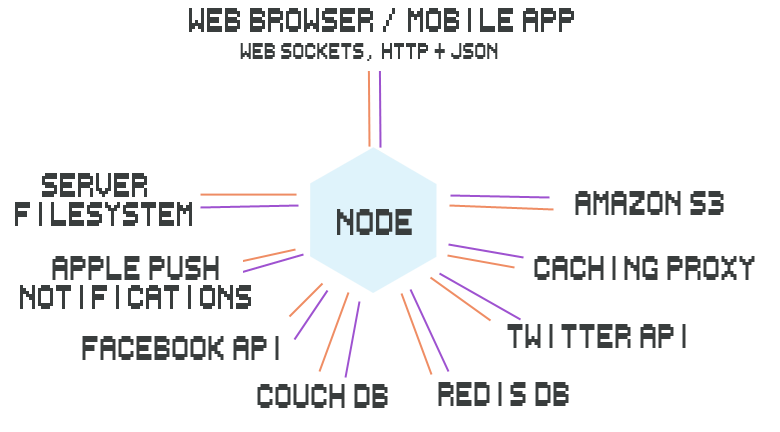
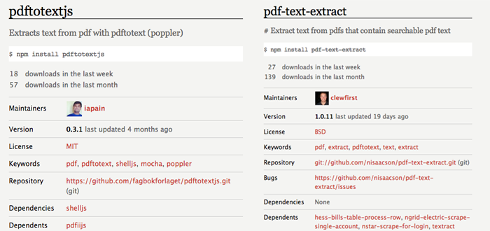
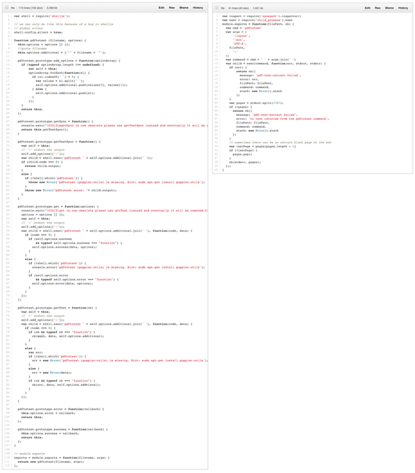
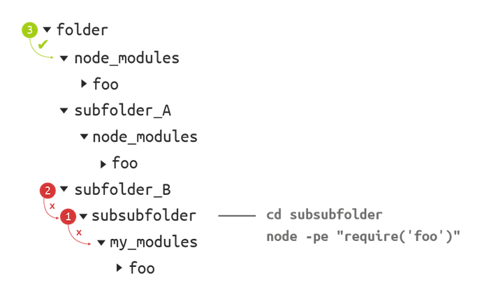
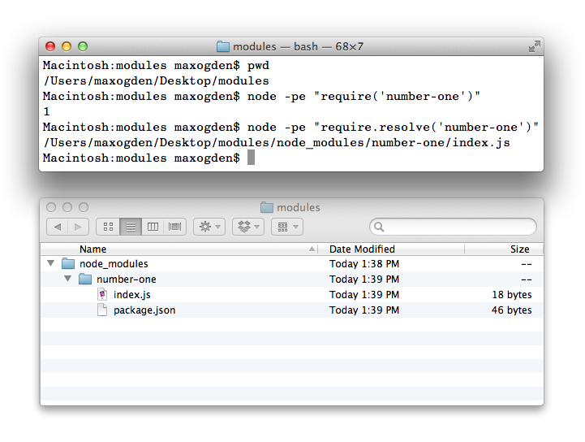
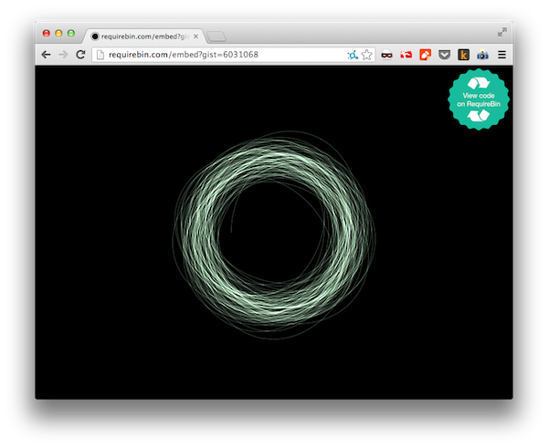

************************** NOTE DU TRADUCTEUR **************************
Ce document est une traduction du document 'Art of Node' de maxogden.
[Vous pouvez le retrouver en version originale en cliquant ici](http://github.com/maxogden/art-of-node)

# The Art of Node
## Une introduction à Node.js

Cet article s'adresse avant-tout aux lecteurs disposants des connaissances suivantes  :

- Au moins un langage de script, tel que JavaScript, Ruby, Python, Perl, etc. Si vous n'êtes pas programmeur, vous préfèrerez commencer par la lecture de [JavaScript for Cats](http://jsforcats.com/). :cat2:
- Git & Github qui sont les outils de collaboration privilégiés par la communauté pour partager ses modules. Quelques connaissances basiques feront l'affaire. Au besoin, trois superbes tutos pour bien démarrer avec git : [1](http://skli.se/2012/09/22/introduction-to-git/), [2](http://ericsteinborn.com/github-for-cats/#/), [3](http://opensourcerer.diy.org/)

Ce court livre est encore en cours de réalisation. Si vous l'aimez, **donnez-moi un dollar** via
[gittip](https://www.gittip.com/maxogden/) pour me permettre d'y consacrer du temps !

[](https://www.gittip.com/maxogden/)

## Sommaire

- [Apprentissage Interactif de Node](#apprentissage-interactif-de-node)
- [Comprendre Node](#comprendre-node)
- [Modules de base](#modules-de-base)
- [Callbacks](#callbacks)
- [Evenements](#evenements)
- [Streams](#streams)
- [Modules and npm](#modules)
- [Client side development with npm](#client-side-development-with-npm)
- [Going with the grain](#going-with-the-grain)

## Apprentissage Interactif de Node

Par expérience, je sais que la simple lecture d'un guide ne se suffit pas à elle-même. Gardez votre éditeur de texte favoris sous la main et écrivez du node en parrallèle ! Apprendre en codant est un excellent moyen d'intégrer les concepts présentés.

### NodeSchool.io

[NodeSchool.io](http://nodeschool.io/) est une série d'ateliers opensource et gratuits qui vous enseignerons les principes de Node.js et plus encore.

[Learn You The Node.js](https://github.com/rvagg/learnyounode#learn-you-the-nodejs-for-much-win) est le cours d'introduction aux ateliers NodeSchool.io. Il s'agit de problèmes qui mettent en scène les principaux cas d'utilisation de Node.js. Il est packagé pour être utilisé en ligne de commande.

[](https://github.com/rvagg/learnyounode#learn-you-the-nodejs-for-much-win)

Vous pouvez l'installer avec npm:

```
# install
npm install learnyounode -g

# start the menu
learnyounode
```

## Comprendre Node

Node.js est un projet opensource prévu pour vous aider à écrire des programmes JavaScript qui interagissent avec des réseaux, des file systems out tout autre source d'I/O (entrée/sortie, lecture/ecriture). Et c'est tout! Ce n'est qu'une plateforme simple et stable qui vous encourage à construire des modules par dessus.

Des exemples d'I/O ? Voici le diagramme d'une application que j'ai réalisé avec node qui présentent un bon nombre de sources d'I/O:



Si vous ne comprenez pas tout ce qu'il y a sur ce diagramme, ce n'est pas un problème. Le but est de vous montrer qu'un simple processus node (l'hexagone au centre) peut agir comme un hub entre les différentes sources d'I/O (en orange et violet sur le diagramme).

Usuellement, produire ce type de système induit :

- D'excellentes performances, mais aux prix de difficultés dans l'écriture (comme partir de zero pour ecrire un serveur web en C)
- Une simplicité d'écriture, mais de faibles performances, ou un manque de robustesse (comme quand quelqu'un essaye d'envoyer un fichier de 5GO et que votre serveur crash)

L'objectif poursuivit par Node est de trouver l'équilibre entre ces deux extrêmités : une simplicité dans sa compréhension et son utilisation, tout en offrant des performances optimales.

Attention, Node n'est ni :

  - Un framework web (comme Rails ou Django, même s'il peut être utilisé pour produire ce genre de choses)
  - Un langage de programmation (Il est basé sur JavaScript mais node n'est pas son propre langage)

A la place, node se situe quelque part au milieu. Il est à la fois :

  - Conçu pour être simple et donc relative facile à comprendre et utiliser
  - Utile pour les programmes fondés sur des I/O, et qui requièrent rapidité, et capacité à gérer de nombreuses connections

A bas niveau, node peut être décrit comme un outil permettant l'écriture de deux types de programmes majeurs :

  - Les programmes de Réseaux qui utilisent les protocoles du web: HTTP, TCP, UDP, DNS and SSL
  - Les programmes qui lisent et écrivent des données dans les filesystem ou dans les processus locaux ou en mémoire.

Qu'est-ce qu'un programme "fondé sur des I/O" ? Voici quelques exemples de sources d'I/O :

  - Bases de données (e.g. MySQL, PostgreSQL, MongoDB, Redis, CouchDB)
  - APIs (e.g. Twitter, Facebook, Notifications Push Apple)
  - HTTP/connections WebSocket (des utilisateurs d'une application web)
  - Fichiers (redimensionnement d'images, editeur video, radio internet)

Node gère les I/O de manière [asynchrone](http://en.wikipedia.org/wiki/Asynchronous_I/O) ce qui le laisse gérer beaucoup de choses différentes simultanément. Par exemple, si vous commander un cheeseburger dans fast-food, ils prendront votre ordre et vous feront patienter le temps que votre plat soit prêt. Pendant ce temps, ils continueront à prendre les commandes des autres clients et pourront tout autant démarrer la cuissons de leur cheeseburger. Maintenant imaginez un peu si vous deviez attendre votre sandwich au comptoire, empêchant tous les clients derrière vous de commander jusqu'à ce que votre produit soit prêt ! On appelle cela l'**I/O Bloquante** car toutes les I/O se produisent l'une après l'autre. Node, à contrario, est **non-bloquante**, ce qui signifie qu'il peut cuire plusieurs cheeseburgers à la fois !

Quelques exemples amusants de choses facilitées par la nature non-bloquante de node :

  - Control [flying quadcopters](http://nodecopter.com)
  - Ecrire des bots IRC
  - Create [walking biped robots](http://www.youtube.com/watch?v=jf-cEB3U2UQ)

## Modules de base

Pour commencer, je vous suggère d'installer node sur votre machine. La manière la plus simple est de visiter [nodejs.org](http://nodejs.org) est de cliquer sur 'Install'.

Node possède un petit groupe de modules (qui réponds communément au nom de 'node core') qui sont présenté en temps qu'API publique, et avec lesquels nous sommes censés écrire nos programmes. Pour travailler avec un file system, il y a le module 'fs', et pour les réseaux, les modules comme `net` (TCP), `http`, `dgram` (UDP).

En sus de `fs` et des modules de réseau, node core propose d'autres modules de base. Il existe un module pour gérer les requêtes DNS de manière asynchrones nommé `dns`, un module pour récupérer les informations spécifiques à l'OS nommé comme la path du tmpdir nommé `os`, un module pour allouer des morceaux de mémoire nommé `buffer`, d'autres pour parser les url et les paths (`url`, `querystring`, `path`), etc. La plus part, sinon tous, sont là pour gérer le principal cas d'utilisation de node: Ecrire rapidement des programmes qui parkent aux files systems et aux réseaux.

Node gère l'I/O avec: callbacks, évènements, streams et modules. Si vous aprennez comment ces quatre choses fonctionnent, alors vous serez capable d'aller dans n'importe lequel des module core de node, et de comprendre comment vous interfacer avec eux.

## Callbacks

Voilà le sujet le plus important si vous voulez comprendre comment utiliser node. Les callbacks sont à peu près partout dans node. Ils n'ont pas été inventés par node cependant, ils font simplement parti de JavaScript.

Les Callbacks sont des fonctions qui s'exécutent de manière asynchrone ou plus tard dans le temps. Au lieu de lire le code de haut en bas de manière procédurale, les programmes asynchrones peuvent executer différentes fonctions à différents moments. Cet ordre sera définit en fonction de l'ordre et de la vitesse des précédents appels, comme les requetes HTTP ou bien encore la lecture du file system.

Cette différence peut entrainer des confusions, car déterminer si une fonction est asynchrone our non dépend beaucoup de son contexte. Voici un exemple synchrone, ce qui signifique que vous pouvez lire ce code de haut en bas comme un livre:

```js
var myNumber = 1
function addOne() { myNumber++ } // define the function
addOne() // run the function
console.log(myNumber) // logs out 2
```

Ce code définie une fonction, puis appel cette fonction, sans attendre quoi que ce soit. Quand la fonction est appelé, elle ajoute immédiatement 1 aux nombre. On peut donc s'attendre à ce qu'après l'appel de cette fonction, le nombre soit égal à 2. De manière assez basique donc, le code synchrone s'exécutre de haut en bas.

Node en revanche, utilise essentiellement du code asynchrone. Utilisons node pour lire notre nombre depuis un fichier appelé `number.txt`:

```js
var fs = require('fs') // require is a special function provided by node
var myNumber = undefined // we don't know what the number is yet since it is stored in a file

function addOne() {
  fs.readFile('number.txt', function doneReading(err, fileContents) {
    myNumber = parseInt(fileContents)
    myNumber++
  })
}

addOne()

console.log(myNumber) // logs out undefined -- this line gets run before readFile is done
```

Pourquoi obtenons nous `undefined` quand nous affichons le chiffre cette fois ci ? Dans ce code, nous utilisons la méthode`fs.readFile`, qui est une méthode asynchrone. Tout ce qui doit parler à un disque dur ou à un réseau aura tendance à être asynchrone. Si leur objectif est simplement d'accéder à la mémoire, ou travailler avec le processeur, alors ils seront synchrone. La raison est que l'I/O est absolument terriblement lent! En guise d'illustration, dites vous que parler avec un disque dur est environ 100,000 fois plus lent que parler à la mémoire(e.g. RAM).

Quand nous lançons ce programme, toutes ses fonctions sont immédiatement définies, mais elles n'ont pas à s'éxecuter immédiatement. C'est un élément fondamental à comprendre en programmation asynchrone. Quand `addOne` est appelé, il démarre `readFile` et enchaine avec le prochain élément prêt à être executé. S'il n'y a rien dans la file d'attente, node attendra les opérations fs/réseau en attente pour terminer, ou il s'arrêtera simplement de tourner et sortira sur la ligne de commande.

Quand `readFile` aura terminé de lire le fichier (cela peut prendre entre quelques millisecondes et plusieurs minutes, en fonction de la vitesse du disque dur) il lancera la fonction `doneReading`, puis lui donnera une erreur (s'il y en a une) et le contenu du fichier.

La raison pour laquelle nous obtenons `undefined` ci-dessus est qu'il n'existe aucune logique dans nos code pour dire à notre `console.log` d'attendre que le `readFile` terminent avant de sortir notre chiffre.

Si vous avez du code que vous voulez pouvoir executer encore et encore, ou simplement plus tard, la première étape consiste à encapsuler ce code dans une fonction. Ensuite, vous pouvez indiquer à votre fonction le moment où elle devra l'éxecuter. Bien évidemment, donner des noms descriptifs à vos fonction aidera grandement.

Les Callbacks sont simplement des fonctions qui s'executent plus tard. La clef pour comprendre les callbacks est de réaliser que vous ne savez pas **quand** une opération asynchrone sera terminée, mais vous savez **où** cette opération doit se compléter - la dernière ligne de votre fonction asynchrone ! L'ordre haut-en-bas de déclaration de vos callbacks n'a pas d'importance, seul l'encapsulation logique compte. Commencez par découper votre code en fonction, puis utilisez vos callbacks pour déclarer qu'une fonction requiert qu'une autre se termine.

La méthode `fs.readFile` fournie par node est asynchrone et il se trouve qu'elle prend beaucoup de temps pour se terminer. Mettez-vous à sa place: elle doit aller interroger l'OS, qui à son tour doit se aller se renseigner auprès du file système, qui vit sur le disque dur, qui peut ne pas en trainer de tourner à des miliers de tours par minute. Ensuite il doit utiliser un laser pour lire une donnée, puis la renvoyer à travers toutes les strates successives de votre programme javascript. Vous donnez donc à `readFile` une fonction (aussi appelé callback) qu'il appelera une fois qu'il aura récupéré les données de votre file system. Il placera les données qu'il a récupéré dans une variable javascript et appelera votre callback avec cette variable. Dans ce cas, la variable est nommé `fileContents` car elle détient le contenu du fichier qui a été lu.

Reprenez l'exemple du restaurant cité au début de ce tuto. Très souvent, vous trouverez dans les restaurant des numéros à poser sur votre table pendant que vous patientez. Ces numéros sont comme des callbacks. Ils indiquent au serveur ce qu'ils doivent faire une fois que votre sandwich est prêt.

Plaçons maintenant notre `console.log` dans une fonction et passons le en callback.

```js
var fs = require('fs')
var myNumber = undefined

function addOne(callback) {
  fs.readFile('number.txt', function doneReading(err, fileContents) {
    myNumber = parseInt(fileContents)
    myNumber++
    callback()
  })
}

function logMyNumber() {
  console.log(myNumber)
}

addOne(logMyNumber)
```

La fonction `logMyNumber` peut désormais être passée en argument qui deviendra la varibale de `callback` dans la fonction `addOne`. Une fois que `readFile` en a terminé, la varibable `callback` sera invoquée (`callback()`). Seules les fonctions peuvent être invoquées, donc si vous passez n'importe quoi d'autre qu'une fonction, il en résultera une erreur.

Quand une fonction est invoquée en JavaScript, le code qu'elle renferme est immédiatement executé. Dans notre cas, notre console log s'éxecutera puisque `callback` est `logMyNumber`. Rappelez-vous, le simple fait de *define* une fonction ne signifie pas qu'elle s'éxecutera. Pour ce faire, vous devez *invoke* une fonction.

Pour aller encore plus loin avec cet exemple, voici une liste chronique des évènements qui se produisent à l'éxécution de ce code:

- 1: Le code est parsé, ce qui signifique qu'une quelquonque erreur syntaxique casserait le programme. Durant cette phase initiale, il y a 4 choses qui sont définies: `fs`, `myNumber`, `addOne`, and `logMyNumber`. Notez qu'elles sont simplement définies. Aucune fonction n'a encore été invoquée ou appellée pour le moment.
- 2: quand la derniere ligne de notre programme est executée `addOne` est invoqué, puis est passé dans la fonction `logMyNumber` comme 'callback', ce qui est bien ce que nous demandons quand `addOne` est terminé. Cela entraine immédiatement le démarrage de la fonction asynchrone `fs.readFile`. Cette partie du programme prend un peu de temps à se terminer.
- 3: Puisqu'il n'a rien à faire, node patiente pendant que `readFile` se termine. S'il y avait une quelquonque autre tache à réaliser, node serait disponible pour faire le boulot.
- 4: `readFile` se termine et appelle son callbacl, `doneReading`, qui à sont tour incrémente le nombre et invoque immédiatement la fonction qu'`addOne` a passé (son callback), `logMyNumber`.

La chose la plus troublante quand on programme avec des callbacks est probablement le fait que les fonctions sont de simples objets, encapsulables dans des variables et que l'on peut passer n'importe où avec des noms différents. Affecter des noms simples et descriptifs à vos variables est primordiable pour rendre votre code lisible pour les autres comme pour vous-même. D'une manière générale, si vous voyez une variable comme `callback` ou `cb` vous pouvez partir du principe qu'il s'agit d'une fonction.

Vous avez peut-être entendu les termes de 'evented programming' (programmation évènementielle) ou 'event loop' (boucle d'évènement). Ils se réfèrent à la manière dont `readFile` est implémenté. Node dispatch d'abord les opérations `readFile` puis attends que `readFile` envoi un évènement qu'il a terminé. Pendant qu'il patiente, node peut aller s'affairer ailleurs. A l'interieur de node, il y a une liste de choses qui ont été dispatchées mais qui n'ont pas encore reçu de feedback, donc node continue de boucler dessus indéfiniment pour vérifier si l'une d'entre elle est terminée. Une fois que l'une d'entre elle est cloturée, node invoque les éventuels callbacks qui lui sont rattachés.

Voila une version de l'exemple précédent en pseudocode:

```js
function addOne(thenRunThisFunction) {
  waitAMinute(function waitedAMinute() {
    thenRunThisFunction()
  })
}

addOne(function thisGetsRunAfterAddOneFinishes() {})
```

Imaginez que vous avez 3 fonctions asynchrones `a`, `b` et `c`. Chacune d'entre elle prend environ 1 minute a être complétée puis lance un callback (qui se voit passé en premier argument). Si vous vouliez dire à node 'lance a, puis b une fois que a est terminé, puis c une fois que b est terminé', cela ressemblerait à cela :

```js
a(function() {
  b(function() {
    c()
  })
})
```
Quand ce code est executé, `a` démarrera immédiatement, puis une minute plus tard il appelera `b`, qui une minute plus tard appelera `c`. Au bout de 3 minutes, node s'arrêtera puisqu'uil n'y aura plus rien à faire. Il y a bien évidemment des méthodes plus élégantes pour écrire le code ci-dessus, mais le but est de montrer que si vous avez du code qui doit attendre un autre code asynchrone pour s'éxecuter, alors il faut exprimer cette dépendance en placant votre code dans une fonction qui sera passé comme callback.

Le design de node requière que vous pensions non-linéairement. Considérez cette liste d'opérations:

```
read a file
process that file
```

Si vous transformiez cela en pseudocode vous obtiendriez ceci:

```
var file = readFile()
processFile(file)
```

Ce type de code non-linéaire (étape par étape, dans l'ordre) n'est pas la manière dont node fonctionne. Si ce code devait être executé, alors `readFile` et `processFile` devraient être lancés au même moment. Cela n'a aucun sens puisque `readFile` mettra du temps à se terminer. A la place, vous devez siginfier que `processFile` dépend de `readFile`. C'est exactement à cela que servent les callbacks ! Et parce que javascript fonctionne ainsi, vous pouvez ecrire cette dépendance de plusieurs manières:

```js
var fs = require('fs')
fs.readFile('movie.mp4', finishedReading)

function finishedReading(error, movieData) {
  if (error) return console.error(error)
  // do something with the movieData
}
```

Mais vous pourriez aussi structurer votre code de cette façon et il fonctionnerait toujours:

```js
var fs = require('fs')

function finishedReading(error, movieData) {
  if (error) return console.error(error)
  // do something with the movieData
}

fs.readFile('movie.mp4', finishedReading)
```

Ou même comme ceci:

```js
var fs = require('fs')

fs.readFile('movie.mp4', function finishedReading(error, movieData) {
  if (error) return console.error(error)
  // do something with the movieData
})
```
/********************* Fin de la traduction au 6/10/2015 *********************/
## Evenements

In node if you require the [events](http://nodejs.org/api/events.html) module you can use the so-called 'event emitter' that node itself uses for all of its APIs that emit things.

Events are a common pattern in programming, known more widely as the ['observer pattern'](http://en.wikipedia.org/wiki/Observer_pattern) or 'pub/sub' (publish/subscribe). Whereas callbacks are a one-to-one relationship between the thing waiting for the callback and the thing calling the callback, events are the same exact pattern except with a many-to-many API.

The easiest way to think about events is that they let you subscribe to things. You can say 'when X do Y', whereas with plain callbacks it is 'do X then Y'.

Here are few common use cases for using events instead of plain callbacks:

- Chat room where you want to broadcast messages to many listeners
- Game server that needs to know when new players connect, disconnect, move, shoot and jump
- Game engine where you want to let game developers subscribe to events like `.on('jump', function() {})`
- A low level web server that wants to expose an API to easily hook into events that happen like `.on('incomingRequest')` or `.on('serverError')`

If we were trying to write a module that connects to a chat server using only callbacks it would look like this:

```js
var chatClient = require('my-chat-client')

function onConnect() {
  // have the UI show we are connected
}

function onConnectionError(error) {
  // show error to the user
}

function onDisconnect() {
 // tell user that they have been disconnected
}

function onMessage(message) {
 // show the chat room message in the UI
}

chatClient.connect(
  'http://mychatserver.com',
  onConnect,
  onConnectionError,
  onDisconnect,
  onMessage
)
```

As you can see this is really cumbersome because of all of the functions that you have to pass in a specific order to the `.connect` function. Writing this with events would look like this:

```js
var chatClient = require('my-chat-client').connect()

chatClient.on('connect', function() {
  // have the UI show we are connected
})

chatClient.on('connectionError', function() {
  // show error to the user
})

chatClient.on('disconnect', function() {
  // tell user that they have been disconnected
})

chatClient.on('message', function() {
  // show the chat room message in the UI
})
```

This approach is similar to the pure-callback approach but introduces the `.on` method, which subscribes a callback to an event. This means you can choose which events you want to subscribe to from the `chatClient`. You can also subscribe to the same event multiple times with different callbacks:

```js
var chatClient = require('my-chat-client').connect()
chatClient.on('message', logMessage)
chatClient.on('message', storeMessage)

function logMessage(message) {
  console.log(message)
}

function storeMessage(message) {
  myDatabase.save(message)
}
```

## Streams

Early on in the node project the file system and network APIs had their own separate patterns for dealing with streaming I/O. For example, files in a file system have things called 'file descriptors' so the `fs` module had to have extra logic to keep track of these things whereas the network modules didn't have such a concept. Despite minor differences in semantics like these, at a fundamental level both groups of code were duplicating a lot of functionality when it came to reading data in and out. The team working on node realized that it would be confusing to have to learn two sets of semantics to essentially do the same thing so they made a new API called the `Stream` and made all the network and file system code use it.

The whole point of node is to make it easy to deal with file systems and networks so it made sense to have one pattern that was used everywhere. The good news is that most of the patterns like these (there are only a few anyway) have been figured out at this point and it is very unlikely that node will change that much in the future.

There are already two great resources that you can use to learn about node streams. One is the stream-adventure (see the Learn Node Interactively section) and the other is a reference called the Stream Handbook.

### Stream Handbook

[stream-handbook](https://github.com/substack/stream-handbook#introduction) is a guide, similar to this one, that contains a reference for everything you could possibly need to know about streams.

[](https://github.com/substack/stream-handbook)

## Modules

Node core is made up of about two dozen modules, some lower level ones like `events` and `stream` some higher level ones like `http` and `crypto`.

This design is intentional. Node core is supposed to be small, and the modules in core should be focused on providing tools for working with common I/O protocols and formats in a way that is cross-platform.

For everything else there is [npm](https://npmjs.org/). Anyone can create a new node module that adds some functionality and publish it to npm. As of the time of this writing there are 34,000 modules on npm.

### How to find a module

Imagine you are trying to convert PDF files into TXT files. The best place to start is by doing `npm search pdf`:


There are a ton of results! npm is quite popular and you will usually be able to find multiple potential solutions. If you go through each module and whittle down the results into a more narrow set (filtering out things like PDF generation modules) you'll end up with these:

- [hummus](https://github.com/galkahana/HummusJS/wiki/Features) - c++ pdf manipulator
- [mimeograph](https://github.com/steelThread/mimeograph) - api on a conglomeration of tools (poppler, tesseract, imagemagick etc)
- [pdftotextjs](https://npmjs.org/package/pdftotextjs) - wrapper around [pdftotext](https://en.wikipedia.org/wiki/Pdftotext)
- [pdf-text-extract](https://npmjs.org/package/pdf-text-extract) - another wrapper around pdftotext
- [pdf-extract](https://npmjs.org/package/pdf-extract) - wrapper around pdftotext, pdftk, tesseract, ghostscript
- [pdfutils](https://npmjs.org/package/pdfutils) - poppler wrapper
- [scissors](https://npmjs.org/package/scissors) - pdftk, ghostscript wrapper w/ high level api
- [textract](https://npmjs.org/package/textract) - pdftotext wrapper
- [pdfiijs](https://github.com/fagbokforlaget/pdfiijs) - pdf to inverted index using textiijs and poppler
- [pdf2json](https://github.com/modesty/pdf2json/blob/master/readme.md) - pure js pdf to json

A lot of the modules have overlapping functionality but present alternate APIs and most of them require external dependencies (like `apt-get install poppler`).

Here are some different ways to interpret the modules:

- `pdf2json` is the only one that is written in pure JavaScript, which means it is the easiest to install, especially on low power devices like the raspberry pi or on Windows where native code might not be cross platform.
- modules like `mimeograph`, `hummus` and `pdf-extract` each combine multiple lower level modules to expose a high level API
- a lot of modules seem to sit on top of the `pdftotext`/`poppler` unix command line tools

Lets compare the differences between `pdftotextjs` and `pdf-text-extract`, both of which are are wrappers around the `pdftotext` utility.



Both of these:

- were updated relatively recently
- have github repositories linked (this is very important!)
- have READMEs
- have at least some number of people installing them every week
- are liberally licensed (anyone can use them)

Just looking at the `package.json` + module statistics it's hard to get a feeling about which one might be the right choice. Let's compare the READMEs:


Both have simple descriptions, CI badges, installation instructions, clear examples and instructions for running the tests. Great! But which one do we use? Let's compare the code:



`pdftotextjs` is around 110 lines of code, and `pdf-text-extract` is around 40, but both essentially boil down to this line:

```
var child = shell.exec('pdftotext ' + self.options.additional.join(' '));
```

Does this make one any better than the other? Hard to say! It's important to actually *read* the code and make your own conclusions. If you find a module you like, use `npm star modulename` to give npm feedback about modules that you had a positive experience with.

### Modular development workflow

npm is different from most package managers in that it installs modules into a folder inside of other existing modules. The previous sentence might not make sense right now but it is the key to npm's success.

Many package managers install things globally. For instance, if you `apt-get install couchdb` on Debian Linux it will try to install the latest stable version of CouchDB. If you are trying to install CouchDB as a dependency of some other piece of software and that software needs an older version of CouchDB, you have to uninstall the newer version of CouchDB and then install the older version. You can't have two versions of CouchDB installed because Debian only knows how to install things into one place.

It's not just Debian that does this. Most programming language package managers work this way too. To address the global dependencies problem described above there have been virtual environment developed like [virtualenv](http://python-guide.readthedocs.org/en/latest/dev/virtualenvs/) for Python or [bundler](http://bundler.io/) for Ruby. These just split your environment up in to many virtual environments, one for each project, but inside each environment dependencies are still globally installed. Virtual environments don't always solve the problem, sometimes they just multiply it by adding additional layers of complexity.

With npm installing global modules is an anti-pattern. Just like how you shouldn't use global variables in your JavaScript programs you also shouldn't install global modules (unless you need a module with an executable binary to show up in your global `PATH`, but you don't always need to do this -- more on this later).

#### How `require` works

When you call `require('some_module')` in node here is what happens:

1. if a file called `some_module.js` exists in the current folder node will load that, otherwise:
2. node looks in the current folder for a `node_modules` folder with a `some_module` folder in it
3. if it doesn't find it, it will go up one folder and repeat step 2

This cycle repeats until node reaches the root folder of the filesystem, at which point it will then check any global module folders (e.g. `/usr/local/node_modules` on Mac OS) and if it still doesn't find `some_module` it will throw an exception.

Here's a visual example:



When the current working directory is `subsubfolder` and `require('foo')` is called, node will look for the folder called `subsubsubfolder/node_modules`. In this case it won't find it -- the folder there is mistakenly called `my_modules`. Then node will go up one folder and try again, meaning it then looks for `subfolder_B/node_modules`, which also doesn't exist. Third try is a charm, though, as `folder/node_modules` does exist *and* has a folder called `foo` inside of it. If `foo` wasn't in there node would continue its search up the directory tree.

Note that if called from `subfolder_B` node will never find `subfolder_A/node_modules`, it can only see `folder/node_modules` on its way up the tree.

One of the benefits of npm's approach is that modules can install their dependent modules at specific known working versions. In this case the module `foo` is quite popular - there are three copies of it, each one inside its parent module folder. The reasoning for this could be that each parent module needed a different version of `foo`, e.g. 'folder' needs `foo@0.0.1`, `subfolder_A` needs `foo@0.2.1` etc.

Here's what happens when we fix the folder naming error by changing `my_modules` to the correct name `node_modules`:


To test out which module actually gets loaded by node, you can use the `require.resolve('some_module')` command, which will show you the path to the module that node finds as a result of the tree climbing process. `require.resolve` can be useful when double-checking that the module that you *think* is getting loaded is *actually* getting loaded -- sometimes there is another version of the same module closer to your current working directory than the one you intend to load.

### How to write a module

Now that you know how to find modules and require them you can start writing your own modules.

#### The simplest possible module

Node modules are radically lightweight. Here is one of the simplest possible node modules:

`package.json`:
```js
{
  "name": "number-one",
  "version": "1.0.0"
}
```

`index.js`:
```js
module.exports = 1
```

By default node tries to load `module/index.js` when you `require('module')`, any other file name won't work unless you set the `main` field of `package.json` to point to it.

Put both of those files in a folder called `number-one` (the `id` in `package.json` must match the folder name) and you'll have a working node module.

Calling the function `require('number-one')` returns the value of whatever `module.exports` is set to inside the module:



An even quicker way to create a module is to run these commands:

```sh
mkdir my_module
cd my_module
git init
git remote add git@github.com:yourusername/my_module.git
npm init
```

Running `npm init` will create a valid `package.json` for you and if you run it in an existing `git` repo it will set the `repositories` field inside `package.json` automatically as well!

#### Adding dependencies

A module can list any other modules from npm or GitHub in the `dependencies` field of `package.json`. To install the `request` module as a new dependency and automatically add it to `package.json` run this from your module root directory:

```sh
npm install --save request
```

This installs a copy of `request` into the closest `node_modules` folder and makes our `package.json` look something like this:

```
{
  "id": "number-one",
  "version": "1.0.0",
  "dependencies": {
    "request": "~2.22.0"
  }
}
```

By default `npm install` will grab the latest published version of a module.

## Client side development with npm

A common misconception about npm is that since it has 'Node' in the name that it must only be used for server side JS modules. This is completely untrue! npm actually stands for Node Packaged Modules, e.g. modules that Node packages together for you. The modules themselves can be whatever you want -- they are just a folder of files wrapped up in a .tar.gz, and a file called `package.json` that declares the module version and a list of all modules that are dependencies of the module (as well as their version numbers so the working versions get installed automatically). It's turtles all the way down - module dependencies are just modules, and those modules can have dependencies etc. etc. etc.

[browserify](http://browserify.org/) is a utility written in Node that tries to convert any node module into code that can be run in browsers. Not all modules work (browsers can't do things like host an HTTP server), but a lot of modules on NPM *will* work.

To try out npm in the browser you can use [RequireBin](http://requirebin.com/), an app I made that takes advantage of [Browserify-CDN](https://github.com/jesusabdullah/browserify-cdn), which internally uses browserify but returns the output through HTTP (instead of the command line -- which is how browserify is usually used).

Try putting this code into RequireBin and then hit the preview button:

```js
var reverse = require('ascii-art-reverse')

// makes a visible HTML console
require('console-log').show(true)

var coolbear =
  "    ('-^-/')  \n" +
  "    `o__o' ]  \n" +
  "    (_Y_) _/  \n" +
  "  _..`--'-.`, \n" +
  " (__)_,--(__) \n" +
  "     7:   ; 1 \n" +
  "   _/,`-.-' : \n" +
  "  (_,)-~~(_,) \n"

setInterval(function() { console.log(coolbear) }, 1000)

setTimeout(function() {
  setInterval(function() { console.log(reverse(coolbear)) }, 1000)
}, 500)
```

Or check out a [more complicated example](http://requirebin.com/?gist=6031068) (feel free to change the code and see what happens):

[](http://requirebin.com/embed?gist=6031068)

## Going with the grain

Like any good tool, node is best suited for a certain set of use cases. For example: Rails, the popular web framework, is great for modeling complex [business logic](http://en.wikipedia.org/wiki/Business_logic), e.g. using code to represent real life business objects like accounts, loan, itineraries, and inventories. While it is technically possible to do the same type of thing using node, there would be definite drawbacks since node is designed for solving I/O problems and it doesn't know much about 'business logic'. Each tool focuses on different problems. Hopefully this guide will help you gain an intuitive understanding of the strengths of node so that you know when it can be useful to you.

### What is outside of node's scope?

Fundamentally node is just a tool used for managing I/O across file systems and networks, and it leaves other more fancy functionality up to third party modules. Here are some things that are outside the scope of node:

#### Web frameworks

There are a number of web frameworks built on top of node (framework meaning a bundle of solutions that attempts to address some high level problem like modeling business logic), but node is not a web framework. Web frameworks that are written using node don't always make the same kind of decisions about adding complexity, abstractions and tradeoffs that node does and may have other priorities.

#### Language syntax

Node uses JavaScript and doesn't change anything about it. Felix Geisendörfer has a pretty good write-up of the 'node style' [here](https://github.com/felixge/node-style-guide).

#### Language abstraction

When possible node will use the simplest possible way of accomplishing something. The 'fancier' you make your JavaScript the more complexity and tradeoffs you introduce. Programming is hard, especially in JS where there are 1000 solutions to every problem! It is for this reason that node tries to always pick the simplest, most universal option. If you are solving a problem that calls for a complex solution and you are unsatisfied with the 'vanilla JS solutions' that node implements, you are free to solve it inside your app or module using whichever abstractions you prefer.

A great example of this is node's use of callbacks. Early on node experimented with a feature called 'promises' that added a number of features to make async code appear more linear. It was taken out of node core for a few reasons:

- they are more complex than callbacks
- they can be implemented in userland (distributed on npm as third party modules)

Consider one of the most universal and basic things that node does: reading a file. When you read a file you want to know when errors happen, like when your hard drive dies in the middle of your read. If node had promises everyone would have to branch their code like this:

```js
fs.readFile('movie.mp4')
  .then(function(data) {
    // do stuff with data
  })
  .error(function(error) {
    // handle error
  })
```

This adds complexity, and not everyone wants that. Instead of two separate functions node just uses a single callback function. Here are the rules:

- When there is no error pass null as the first argument
- When there is an error, pass it as the first argument
- The rest of the arguments can be used for anything (usually data or responses since most stuff in node is reading or writing things)

Hence, the node callback style:

```js
fs.readFile('movie.mp4', function(err, data) {
  // handle error, do stuff with data
})
```

#### Threads/fibers/non-event-based concurrency solutions

Note : Si vous ne savez pas ce que ces choses signifient, il sera probablement plus simple d'apprendre node, puisque désapprendre constitue tout autant de travail qu'apprendre.

Node utilise des threads internes pour accélerer les choses, mais ne les expose par à l'utilisateur. Si vous êtes un utilisateur technique et que vous vous demandez pourquoi node est conçu ainsi, alors vous devriez absolument lire [the design of libuv](http://nikhilm.github.com/uvbook/), la couche I/O en C++ sur laquelle node est fondé.

## License


Creative Commons Attribution License (do whatever, just attribute me)
http://creativecommons.org/licenses/by/2.0/

L'icone de don provient de [Noun Project](http://thenounproject.com/term/donate/285/)
