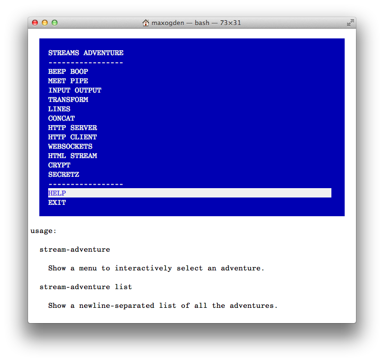

# A arte do node
## Uma introdução ao Node.js

Este documento é destinado à leitores que sabem no mínimo algumas das coisas abaixo:

- Uma linguagem de script como JavaScript, Ruby, Python, Perl, etc. Se você ainda não é um programador então é provavelmente mais fácil começar a ler  [JavaScript for Cats](http://jsforcats.com/). :cat2:
- git e github. Estas são ferramentas de colaboração de código aberto que pessoas da comunidade node usam para compartilhar módulos. Você só precisa saber o básico. Aqui estão três ótimos tutoriais de introdução. [1](http://skli.se/2012/09/22/introduction-to-git/), [2](http://zachbruggeman.me/github-for-cats/), [3](http://opensourcerer.diy.org/) (inglês)

Este pequeno livro é um trabalho em progresso. Se você gosta deste livro considere **fazer uma doação** via [gittip](https://www.gittip.com/maxogden/) para que eu possa escrever muito mais.

[](https://www.gittip.com/maxogden/)

## Tabela de Conteúdo

- [Entendendo node](#understanding-node)
- [Módulos do core](#core-modules)
- [Callbacks](#callbacks) (Parcialmente traduzido)
- [Eventos](#events) (Não traduzido ainda)
- [Streams](#streams) (Não traduzido ainda)
- [Módulos e npm](#modules) (Não traduzido ainda)
- [Desenvolvimento client-side com npm](#client-side-development-with-npm) (Não traduzido ainda) 
- [Going with the grain](#going-with-the-grain) (Não traduzido ainda)

## Entendendo node

Node.js é um projeto de código aberto feito para te ajudar a escrever programas JavaScript que se comunicam com a rede, sistemas de arquivo ou outros 
códigos I/O(Entrada/Saida, Leitura/Escrita). É isso! Node é apenas uma simples e estável plataforma I/O que encoraja a construção de módulos sobre
ela mesma.

Quais são os exemplos de I/O? Aqui está um diagrama de uma aplicação que foi feita com node que mostra algumas fontes I/O:


Se você não entende todo os elementos do diagrama está tudo bem. O ponto é mostrar que um simples processo em node(o hexágono no meio) pode atuar como o agente entre todos os pontos finais de I/O(laranja e roxo representam I/O).

Normalmente construir este tipo de sistema apresentam alguns dos casos:

- Dificuldade para programar, mas robusto e com boa performance (Como escrever seus servidores web do zero em C)
- Facilidade para programar, mas não muito robusto/rápido (Como quando alguem tenta fazer upload de um arquivo de 5GB e seu servidor para)

O objetivo de node é prover um balanço entre estes dois: Relativamente fácil para entender e usar, e rápido o suficiente para a maioria dos casos.

Node não é nenhuma das coisas a seguir:

  - Um framework web (como Rails ou Django, embora possa ser usado para fazer tais coisas)
  - Uma linguagem de programação (Node usa JavaScript mas não é uma linguagem por si só)
  
Em vez disso, node é uma coisa no meio. node é:

  - Desenhado para ser simples e relativamente fácil de entender e usar
  - Útil para programas baseados no I/O que precisam ser rápidos e manusear várias conexões
  
Em um nível mais baixo, node pode ser descrito com uma ferramenta para escrever dois maiores tipos de programas: 

  - Programas de rede usando os protocolos da web: HTTP, TCP, UDP, DNS e SSL
  - Programas que lêem e escrevem dados em sistemas de arquivos e os processos/memoria local

O que é um "Programa baseado em I/O?" Aqui estão alguns usos comuns:

  - Bancos de dados (ex: MySQL, PostgreSQL, MongoDB, Redis, CouchDB)
  - APIs (ex: Twitter, Facebook, Apple Push Notifications)
  - Conexões HTTP/WebSocket (de usuários para um web app)
  - Arquivos (Editor de imagem, Editor de vídeo, Radio por Internet)

Node processa I/O de forma [asíncrona](http://en.wikipedia.org/wiki/Asynchronous_I/O)(ingles) que permite manejar várias coisas diferentes simultaneamente. Por exemplo, se você for a um fast food e pedir um cheesburger eles vão pegar seu pedido imediatamente e então fazer você esperar até que o cheesburger esteja pronto. Neste tempo eles podem pegar outros pedido e começar a fazer os cheesburgers para outras pessoas. Imagine que você tem que esperar na fila, bloqueando todas as outras pessoas na fila enquanto eles preparam o seu hamburger! Isto é chamado **I/O Bloqueador** porque todo o I/O (preparamento dos chessburgers) acontece uma vez por tempo. Node, por outro lado, é **Não-bloqueador**, o que significa que pode preparar vários chessburgers de uma vez.

Aqui estão algumas coisas divertidas feitas de forma fácil com node graças a sua natureza não-bloqueadora
  
  - Controlar [Quadcopters voadores](http://nodecopter.com)
  - Escrever bots para chat IRC
  - Criar [Robôs bípedes que andam](http://www.youtube.com/watch?v=jf-cEB3U2UQ)

## Módulos do core

Primeiro eu recomendo que você instale node.js no seu computador. A maneira mais fácil é visitando [nodejs.org](http://nodejs.org) e clicar em `install`

Node tem um pequeno grupo de módulos no seu core (geralmente chamado de 'node core') os quais são apresentados como uma API pública que tem como objetivo escrever programas com eles. Para trabalhar com sistema de arquivos temos o módulo `fs` e para redes existem os módulos `net` (TCP), `http`, `dgram` (UDP).

Em adição aos módulos `fs` e de rede existem outros módulos no node core. Existe um módulo para resolver consultas DNS asincronamente chamado `dns`, um módulo para pegar informações específicas do SO como o tmpdir chamado `os`, um módulo para alocação de pedaços binários de memória chamado `buffer`, alguns módulos para parsear urls e diretórios (`url`, `querystring`, `path`), etc. A maioria se não todos os módulos no node core estão ali para suportar os principais casos de uso do node: escrever rápidos programas que se comunicam com sistemas de arquivos ou redes.

Node maneja I/O com: callbacks, eventos, streams e módulos. Se você aprender como estas 4 coisas funcionam então você será capaz de ir dentro de qualquer módulo no node core e entender basicamente como interagir com eles.

## Callbacks

Esta é o tópico mais importante para entender se você quiser entender como usar o node. Quase tudo em node usa callbacks. Eles não foram inventados pelo node, eles são apenas partes da linguagem JavaScript.

Callbacks são funções que são executadas asincronamente, ou um tempo depois. Ao invés do código ser lido de cima para baixo, programs asincronos podem executar diferentes funções em tempos diferentes baseado na ordem e velocidade de funções declaradas antes como http requests ou leituras de sistema de arquivo.

A diferença pode ser confusa já que uma função ser asincrona ou não depende muito do contexto. Aqui está um simples exemplo síncrono, você lê de cima para baixo assim como um livro:

```js
var myNumber = 1
function addOne() { myNumber++ } // define the function
addOne() // run the function
console.log(myNumber) // logs out 2
```

The code here defines a function and then on the next line calls that function, without waiting for anything. When the function is called it immediately adds 1 to the number, so we can expect that after we call the function the number should be 2. This is the expectation of synchronous code - it sequentially top to bottom.

Node, however, uses mostly asynchronous code. Let's use node to read our number from a file called `number.txt`:

```js
var fs = require('fs') // require is a special function provided by node
var myNumber = undefined // we don't know what the number is yet since it is stored in a file

function addOne() {
  fs.readFile('number.txt', function doneReading(err, fileContents) {
    myNumber = parseInt(fileContents)
    myNumber++
  })
}

addOne()

console.log(myNumber) // logs out undefined -- this line gets run before readFile is done
```

Why do we get `undefined` when we log out the number this time? In this code we use the `fs.readFile` method, which happens to be an asynchronous method. Usually things that have to talk to hard drives or networks will be asynchronous. If they just have to access things in memory or do some work on the CPU they will be synchronous. The reason for this is that I/O is reallyyy reallyyy sloowwww. A ballpark figure would be that talking to a hard drive is about 100,000 times slower than talking to memory (e.g. RAM).

When we run this program all of the functions are immediately defined, but they don't all execute immediately. This is a fundamental thing to understand about async programming. When `addOne` is called it kicks off a `readFile` and then moves on to the next thing that is ready to execute. If there is nothing to execute node will either wait for pending fs/network operations to finish or it will stop running and exit to the command line.

When `readFile` is done reading the file (this may take anywhere from milliseconds to seconds to minutes depending on how fast the hard drive is) it will run the `doneReading` function and give it an error (if there was an error) and the file contents.

The reason we got `undefined` above is that nowhere in our code exists logic that tells the `console.log` statement to wait until the `readFile` statement finishes before it prints out the number.

If you have some code that you want to be able to execute over and over again or at a later time the first step is to put that code inside a function. Then you can call the function whenever you want to run your code. It helps to give your functions descriptive names.

Callbacks are just functions that get executed at some later time. The key to understanding callbacks is to realize that they are used when you don't know **when** some async operation will complete, but you do know **where** the operation will complete — the last line of the async function! The top-to-bottom order that you declare callbacks does not necessarily matter, only the logical/hierarchical nesting of them. First you split your code up into functions, and then use callbacks to declare if one function depends on another function finishing.

The `fs.readFile` method is provided by node, is asynchronous and happens to take a long time to finish. Consider what it does: it has to go to the operating system, which in turn has to go to the file system, which lives on a hard drive that may or may not be spinning at thousands of revolutions per minute. Then it has to use a laser to read data and send it back up through the layers back into your javascript program. You give `readFile` a function (known as a callback) that it will call after it has retrieved the data from the file system. It puts the data it retrieved into a javascript variable and calls your function (callback) with that variable, in this case the variable is called `fileContents` because it contains the contents of the file that was read.

Think of the restaurant example at the beginning of this tutorial. At many restaurants you get a number to put on your table while you wait for your food. These are a lot like callbacks. They tell the server what to do after your cheeseburger is done.

Let's put our `console.log` statement into a function and pass it in as a callback.

```js
var fs = require('fs')
var myNumber = undefined

function addOne(callback) {
  fs.readFile('number.txt', function doneReading(err, fileContents) {
    myNumber = parseInt(fileContents)
    myNumber++
    callback()
  })
}

function logMyNumber() {
  console.log(myNumber)
}

addOne(logMyNumber)
```

Now the `logMyNumber` function can get passed in an argument that will become the `callback` variable inside the `addOne` function. After `readFile` is done the `callback` variable will be invoked (`callback()`). Only functions can be invoked, so if you pass in anything other than a function it will cause an error.

When a function gets invoked in javascript the code inside that function will immediately get executed. In this case our log statement will execute since `callback` is actually `logMyNumber`. Remember, just because you *define* a function it doesn't mean it will execute. You have to *invoke* a function for that to happen.

To break down this example even more, here is a timeline of events that happen when we run this program:

- 1: the code is parsed, which means if there are any syntax errors they would make the program break. During this initial phase there are 4 things that get defined: `fs`, `myNumber`, `addOne`, and `logMyNumber`. Note that these are just being defined, no functions have been called/invoked yet.
- 2: When the last line of our program gets executed `addOne` gets invoked, getting passed in the `logMyNumber` function as `callback`, which is what we want to be called when `addOne` is complete. This immediately causes the asynchronous `fs.readFile` function to kick off. This part of the program takes a while to finish.
- 3: with nothing to do, node idles for a bit as it waits for `readFile` to finish. If there was anything else to do during this time, node would be available for work.
- 4: `readFile` finishes and calls its callback, `doneReading`, which then in turn increments the number and then immediately invokes the function that `addOne` passed in (its callback), `logMyNumber`.

Perhaps the most confusing part of programming with callbacks is how functions are just objects that can be stored in variables and passed around with different names. Giving simple and descriptive names to your variables is important in making your code readable by others. Generally speaking in node programs when you see a variable like `callback` or `cb` you can assume it is a function.

You may have heard the terms 'evented programming' or 'event loop'. They refer to the way that `readFile` is implemented. Node first dispatches the `readFile` operation and then waits for `readFile` to send it an event that it has completed. While it is waiting node can go check on other things. Inside node there is a list of things that are dispatched but haven't reported back yet, so node loops over the list again and again checking to see if they are finished. After they finished they get 'processed', e.g. any callbacks that depended on them finishing will get invoked.

Here is a pseudocode version of the above example:

```js
function addOne(thenRunThisFunction) {
  waitAMinute(function waitedAMinute() {
    thenRunThisFunction()
  })
}

addOne(function thisGetsRunAfterAddOneFinishes() {})
```

Imagine you had 3 async functions `a`, `b` and `c`. Each one takes 1 minute to run and after it finishes it calls a callback (that gets passed in the first argument). If you wanted to tell node 'start running a, then run b after a finishes, and then run c after b finishes' it would look like this:

```js
a(function() {
  b(function() {
    c()
  })
})
```

When this code gets executed, `a` will immediately start running, then a minute later it will finish and call `b`, then a minute later it will finish and call `c` and finally 3 minutes later node will stop running since there would be nothing more to do. There are definitely more elegant ways to write the above example, but the point is that if you have code that has to wait for some other async code to finish then you express that dependency by putting your code in functions that get passed around as callbacks.

The design of node requires you to think non-linearly. Consider this list of operations:

```
read a file
process that file
```

If you were to turn this into pseudocode you would end up with this:

```
var file = readFile()
processFile(file)
```

This kind of linear (step-by-step, in order) code isn't the way that node works. If this code were to get executed then `readFile` and `processFile` would both get executed at the same exact time. This doesn't make sense since `readFile` will take a while to complete. Instead you need to express that `processFile` depends on `readFile` finishing. This is exactly what callbacks are for! And because of the way that JavaScript works you can write this dependency many different ways:

```js
var fs = require('fs')
fs.readFile('movie.mp4', finishedReading)

function finishedReading(error, movieData) {
  if (error) return console.error(error)
  // do something with the movieData
}
```

But you could also structure your code like this and it would still work:

```js
var fs = require('fs')

function finishedReading(error, movieData) {
  if (error) return console.error(error)
  // do something with the movieData
}

fs.readFile('movie.mp4', finishedReading)
```

Or even like this:

```js
var fs = require('fs')

fs.readFile('movie.mp4', function finishedReading(error, movieData) {
  if (error) return console.error(error)
  // do something with the movieData
})
```

## Events

In node if you require the [events](http://nodejs.org/api/events.html) module you can use the so-called 'event emitter' that node itself uses for all of its APIs that emit things.

Events are a common pattern in programming, known more widely as the ['observer pattern'](http://en.wikipedia.org/wiki/Observer_pattern) or 'pub/sub' (publish/subscribe). Whereas callbacks are a one-to-one relationship between the thing waiting for the callback and the thing calling the callback, events are the same exact pattern except with a many-to-many API.

The easiest way to think about events is that they let you subscribe to things. You can say 'when X do Y', whereas with plain callbacks it is 'do X then Y'.

Here are few common use cases for using events instead of plain callbacks:

- Chat room where you want to broadcast messages to many listeners
- Game server that needs to know when new players connect, disconnect, move, shoot and jump
- Game engine where you want to let game developers subscribe to events like `.on('jump', function() {})`
- A low level web server that wants to expose an API to easily hook into events that happen like `.on('incomingRequest')` or `.on('serverError')`

If we were trying to write a module that connects to a chat server using only callbacks it would look like this:

```js
var chatClient = require('my-chat-client')

function onConnect() {
  // have the UI show we are connected
}

function onConnectionError(error) {
  // show error to the user
}

function onDisconnect() {
 // tell user that they have been disconnected
}

function onMessage(message) {
 // show the chat room message in the UI
}

chatClient.connect(
  'http://mychatserver.com',
  onConnect,
  onConnectionError,
  onDisconnect,
  onMessage
)
```

As you can see this is really cumbersome because of all of the functions that you have to pass in a specific order to the `.connect` function. Writing this with events would look like this:

```js
var chatClient = require('my-chat-client').connect()

chatClient.on('connect', function() {
  // have the UI show we are connected
}) 

chatClient.on('connectionError', function() {
  // show error to the user
})

chatClient.on('disconnect', function() {
  // tell user that they have been disconnected
})

chatClient.on('message', function() {
  // show the chat room message in the UI
})
```

This approach is similar to the pure-callback approach but introduces the `.on` method, which subscribes a callback to an event. This means you can choose which events you want to subscribe to from the `chatClient`. You can also subscribe to the same event multiple times with different callbacks:

```js
var chatClient = require('my-chat-client').connect()
chatClient.on('message', logMessage)
chatClient.on('message', storeMessage)

function logMessage(message) {
  console.log(message)
}

function storeMessage(message) {
  myDatabase.save(message)
}
```

## Streams

Early on in the node project the file system and network APIs had their own separate patterns for dealing with streaming I/O. For example, files in a file system have things called 'file descriptors' so the `fs` module had to have extra logic to keep track of these things whereas the network modules didn't have such a concept. Despite minor differences in semantics like these, at a fundamental level both groups of code were duplicating a lot of functionality when it came to reading data in and out. The team working on node realized that it would be confusing to have to learn two sets of semantics to essentially do the same thing so they made a new API called the `Stream` and made all the network and file system code use it. 

The whole point of node is to make it easy to deal with file systems and networks so it made sense to have one pattern that was used everywhere. The good news is that most of the patterns like these (there are only a few anyway) have been figured out at this point and it is very unlikely that node will change that much in the future.

There are already two great resources that you can use to learn about node streams:

### Stream Adventure

[stream-adventure](https://github.com/substack/stream-adventure) by @substack is an interactive command line stream tutorial. You can install it with npm:

```
# install
npm install stream-adventure -g

# start the adventure
stream-adventure
```

[](https://github.com/substack/stream-adventure)

### Stream Handbook

[stream-handbook](https://github.com/substack/stream-handbook#introduction) is a guide, similar to this one, that contains a reference for everything you could possibly need to know about streams.

[](https://github.com/substack/stream-handbook)

## Modules

Node core is made up of about two dozen modules, some lower level ones like `events` and `stream` some higher level ones like `http` and `crypto`.

This design is intentional. Node core is supposed to be small, and the modules in core should be focused on providing tools for working with common I/O protocols and formats in a way that is cross-platform.

For everything else there is [npm](https://npmjs.org/). Anyone can create a new node module that adds some functionality and publish it to npm. As of the time of this writing there are 34,000 modules on npm.

### How to find a module

Imagine you are trying to convert PDF files into TXT files. The best place to start is by doing `npm search pdf`:


There are a ton of results! npm is quite popular and you will usually be able to find multiple potential solutions. If you go through each module and whittle down the results into a more narrow set (filtering out things like PDF generation modules) you'll end up with these:

- [hummus](https://github.com/galkahana/HummusJS/wiki/Features) - c++ pdf manipulator
- [mimeograph](https://github.com/steelThread/mimeograph) - api on a conglomeration of tools (poppler, tesseract, imagemagick etc)
- [pdftotextjs](https://npmjs.org/package/pdftotextjs) - wrapper around [pdftotext](https://en.wikipedia.org/wiki/Pdftotext)
- [pdf-text-extract](https://npmjs.org/package/pdf-text-extract) - another wrapper around pdftotext
- [pdf-extract](https://npmjs.org/package/pdf-extract) - wrapper around pdftotext, pdftk, tesseract, ghostscript
- [pdfutils](https://npmjs.org/package/pdfutils) - poppler wrapper
- [scissors](https://npmjs.org/package/scissors) - pdftk, ghostscript wrapper w/ high level api
- [textract](https://npmjs.org/package/textract) - pdftotext wrapper
- [pdfiijs](https://github.com/fagbokforlaget/pdfiijs) - pdf to inverted index using textiijs and poppler
- [pdf2json](https://github.com/modesty/pdf2json/blob/master/readme.md) - pure js pdf to json

A lot of the modules have overlapping functionality but present alternate APIs and most of them require external dependencies (like `apt-get install poppler`).

Here are some different ways to interpret the modules:

- `pdf2json` is the only one that is written in pure JavaScript, which means it is the easiest to install, especially on low power devices like the raspberry pi or on Windows where native code might not be cross platform.
- modules like `mimeograph`, `hummus` and `pdf-extract` each combine multiple lower level modules to expose a high level API
- a lot of modules seem to sit on top of the `pdftotext`/`poppler` unix command line tools

Lets compare the differences between `pdftotextjs` and `pdf-text-extract`, both of which are are wrappers around the `pdftotext` utility.


Both of these:

- were updated relatively recently
- have github repositories linked (this is very important!)
- have READMEs
- have at least some number of people installing them every week
- are liberally licensed (anyone can use them)

Just looking at the `package.json` + module statistics it's hard to get a feeling about which one might be the right choice. Let's compare the READMEs:


Both have simple descriptions, CI badges, installation instructions, clear examples and instructions for running the tests. Great! But which one do we use? Let's compare the code:


`pdftotextjs` is around 110 lines of code, and `pdf-text-extract` is around 40, but both essentially boil down to this line:

```
var child = shell.exec('pdftotext ' + self.options.additional.join(' '));
```

Does this make one any better than the other? Hard to say! It's important to actually *read* the code and make your own conclusions. If you find a module you like, use `npm star modulename` to give npm feedback about modules that you had a positive experience with.

### Modular development workflow

npm is different from most package managers in that it installs modules into a folder inside of other existing modules. The previous sentence might not make sense right now but it is the key to npm's success.

Many package managers install things globally. For instance, if you `apt-get install couchdb` on Debian Linux it will try to install the latest stable version of CouchDB. If you are trying to install CouchDB as a dependency of some other piece of software and that software needs an older version of CouchDB, you have to uninstall the newer version of CouchDB and then install the older version. You can't have two versions of CouchDB installed because Debian only knows how to install things into one place.

It's not just Debian that does this. Most programming language package managers work this way too. To address the global dependencies problem described above there have been virtual environment developed like [virtualenv](http://docs.python-guide.org/en/latest/dev/virtualenvs.html) for Python or [bundler](http://bundler.io/) for Ruby. These just split your environment up in to many virtual environments, one for each project, but inside each environment dependencies are still globally installed. Virtual environments don't always solve the problem, sometimes they just multiply it by adding additional layers of complexity.

With npm installing global modules is an anti-pattern. Just like how you shouldn't use global variables in your JavaScript programs you also shouldn't install global modules (unless you need a module with an executable binary to show up in your global `PATH`, but you don't always need to do this -- more on this later).

#### How `require` works

When you call `require('some_module')` in node here is what happens:

1. if a file called `some_module.js` exists in the current folder node will load that, otherwise:
2. node looks in the current folder for a `node_modules` folder with a `some_module` folder in it
3. if it doesn't find it, it will go up one folder and repeat step 2

This cycle repeats until node reaches the root folder of the filesystem, at which point it will then check any global module folders (e.g. `/usr/local/node_modules` on Mac OS) and if it still doesn't find `some_module` it will throw an exception.

Here's a visual example:


When the current working directory is `subsubfolder` and `require('foo')` is called, node will look for the folder called `subsubsubfolder/node_modules`. In this case it won't find it -- the folder there is mistakenly called `my_modules`. Then node will go up one folder and try again, meaning it then looks for `subfolder_B/node_modules`, which also doesn't exist. Third try is a charm, though, as `folder/node_modules` does exist *and* has a folder called `foo` inside of it. If `foo` wasn't in there node would continue its search up the directory tree.

Note that if called from `subfolder_B` node will never find `subfolder_A/node_modules`, it can only see `folder/node_modules` on its way up the tree.

One of the benefits of npm's approach is that modules can install their dependent modules at specific known working versions. In this case the module `foo` is quite popular - there are three copies of it, each one inside its parent module folder. The reasoning for this could be that each parent module needed a different version of `foo`, e.g. 'folder' needs `foo@0.0.1`, `subfolder_A` needs `foo@0.2.1` etc.

Here's what happens when we fix the folder naming error by changing `my_modules` to the correct name `node_modules`:


To test out which module actually gets loaded by node, you can use the `require.resolve('some_module')` command, which will show you the path to the module that node finds as a result of the tree climbing process. `require.resolve` can be useful when double-checking that the module that you *think* is getting loaded is *actually* getting loaded -- sometimes there is another version of the same module closer to your current working directory than the one you intend to load.

### How to write a module

Now that you know how to find modules and require them you can start writing your own modules.

#### The simplest possible module

Node modules are radically lightweight. Here is one of the simplest possible node modules:

`package.json`:
```js
{
  "id": "number-one",
  "version": "1.0.0"
}
```

`index.js`:
```js
module.exports = 1
```

By default node tries to load `module/index.js` when you `require('module')`, any other file name won't work unless you set the `main` field of `package.json` to point to it.

Put both of those files in a folder called `number-one` (the `id` in `package.json` must match the folder name) and you'll have a working node module.

Calling the function `require('number-one')` returns the value of whatever `module.exports` is set to inside the module:


An even quicker way to create a module is to run these commands:

```sh
mkdir my_module
cd my_module
git init
git remote add git@github.com:yourusername/my_module.git
npm init
```

Running `npm init` will create a valid `package.json` for you and if you run it in an existing `git` repo it will set the `repositories` field inside `package.json` automatically as well!

#### Adding dependencies

A module can list any other modules from npm or GitHub in the `dependencies` field of `package.json`. To install the `request` module as a new dependency and automatically add it to `package.json` run this from your module root directory:

```sh
npm install --save request
```

This installs a copy of `request` into the closest `node_modules` folder and makes our `package.json` look something like this:

```
{
  "id": "number-one",
  "version": "1.0.0",
  "dependencies": {
    "request": "~2.22.0"
  }
}
```

By default `npm install` will grab the latest published version of a module.

## Client side development with npm

A common misconception about npm is that since it has 'Node' in the name that it must only be used for server side JS modules. This is completely untrue! npm actually stands for Node Packaged Modules, e.g. modules that Node packages together for you. The modules themselves can be whatever you want -- they are just a folder of files wrapped up in a .tar.gz, and a file called `package.json` that declares the module version and a list of all modules that are dependencies of the module (as well as their version numbers so the working versions get installed automatically). It's turtles all the way down - module dependencies are just modules, and those modules can have dependencies etc. etc. etc.

[browserify](http://browserify.org/) is a utility written in Node that tries to convert any node module into code that can be run in browsers. Not all modules work (browsers can't do things like host an HTTP server), but a lot of modules on NPM *will* work.

To try out npm in the browser you can use [RequireBin](http://requirebin.com/), an app I made that takes advantage of [Browserify-CDN](https://github.com/jesusabdullah/browserify-cdn), which internally uses browserify but returns the output through HTTP (instead of the command line -- which is how browserify is usually used).

Try putting this code into RequireBin and then hit the preview button:

```js
var reverse = require('ascii-art-reverse')

// makes a visible HTML console
require('console-log').show(true)

var coolbear =
  "    ('-^-/')  \n" +
  "    `o__o' ]  \n" +
  "    (_Y_) _/  \n" +
  "  _..`--'-.`, \n" +
  " (__)_,--(__) \n" +
  "     7:   ; 1 \n" +
  "   _/,`-.-' : \n" +
  "  (_,)-~~(_,) \n"

setInterval(function() { console.log(coolbear) }, 1000)

setTimeout(function() {
  setInterval(function() { console.log(reverse(coolbear)) }, 1000)
}, 500)
```

Or check out a [more complicated example](http://requirebin.com/?gist=6031068) (feel free to change the code and see what happens):

[](http://requirebin.com/embed?gist=6031068)

## Going with the grain

Like any good tool, node is best suited for a certain set of use cases. For example: Rails, the popular web framework, is great for modeling complex [business logic](http://en.wikipedia.org/wiki/Business_logic), e.g. using code to represent real life business objects like accounts, loan, itineraries, and inventories. While it is technically possible to do the same type of thing using node, there would be definite drawbacks since node is designed for solving I/O problems and it doesn't know much about 'business logic'. Each tool focuses on different problems. Hopefully this guide will help you gain an intuitive understanding of the strengths of node so that you know when it can be useful to you.

### What is outside of node's scope?

Fundamentally node is just a tool used for managing I/O across file systems and networks, and it leaves other more fancy functionality up to third party modules. Here are some things that are outside the scope of node:

#### Web frameworks

There are a number of web frameworks built on top of node (framework meaning a bundle of solutions that attempts to address some high level problem like modeling business logic), but node is not a web framework. Web frameworks that are written using node don't always make the same kind of decisions about adding complexity, abstractions and tradeoffs that node does and may have other priorities.

#### Language syntax

Node uses JavaScript and doesn't change anything about it. Felix Geisendörfer has a pretty good write-up of the 'node style' [here](https://github.com/felixge/node-style-guide).

#### Language abstraction

When possible node will use the simplest possible way of accomplishing something. The 'fancier' you make your JavaScript the more complexity and tradeoffs you introduce. Programming is hard, especially in JS where there are 1000 solutions to every problem! It is for this reason that node tries to always pick the simplest, most universal option. If you are solving a problem that calls for a complex solution and you are unsatisfied with the 'vanilla JS solutions' that node implements, you are free to solve it inside your app or module using whichever abstractions you prefer.

A great example of this is node's use of callbacks. Early on node experimented with a feature called 'promises' that added a number of features to make async code appear more linear. It was taken out of node core for a few reasons:

- they are more complex than callbacks
- they can be implemented in userland (distributed on npm as third party modules)

Consider one of the most universal and basic things that node does: reading a file. When you read a file you want to know when errors happen, like when your hard drive dies in the middle of your read. If node had promises everyone would have to branch their code like this:

```js
fs.readFile('movie.mp4')
  .then(function(data) {
    // do stuff with data
  })
  .error(function(error) {
    // handle error
  })
```

This adds complexity, and not everyone wants that. Instead of two separate functions node just uses a single callback function. Here are the rules:

- When there is no error pass null as the first argument
- When there is an error, pass it as the first argument
- The rest of the arguments can be used for anything (usually data or responses since most stuff in node is reading or writing things)

Hence, the node callback style:

```js
fs.readFile('movie.mp4', function(err, data) {
  // handle error, do stuff with data
})
```

#### Threads/fibers/non-event-based concurrency solutions

Note: If you don't know what these things mean then you will likely have an easier time learning node, since unlearning things is just as much work as learning things.

Node uses threads internally to make things fast but doesn't expose them to the user. If you are a technical user wondering why node is designed this way then you should 100% read about [the design of libuv](http://nikhilm.github.com/uvbook/), the C++ I/O layer that node is built on top of.

## License


Creative Commons Attribution License (do whatever, just attribute me)
http://creativecommons.org/licenses/by/2.0/

Donate icon is from the [http://thenounproject.com/noun/donate/#icon-No285](Noun Project)
